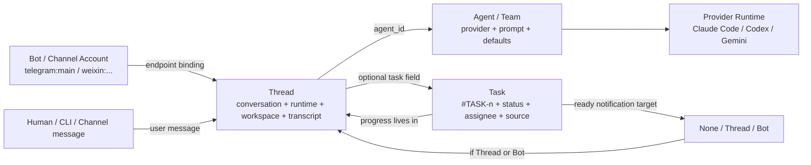

# Garyx Task 与 Thread 模型设计

这份文档用于对外讲清 Garyx 里的任务系统和线程系统怎么建模、怎么路由、怎么运行，以及为什么 Task 不是独立会话实体，而是建立在线程之上的任务覆盖层。

## 一句话模型

Garyx 的核心运行单元是 **Thread**。

**Thread** 承载对话、运行时、工作目录、渠道绑定和 transcript；**Task** 是挂在某个 Thread 上的一层任务元数据，用来表达“这段线程正在承担一项可指派、可审阅、可追踪的工作”。

换句话说：

- Thread 负责“在哪里说话、谁来干活、在哪个目录执行、历史怎么保存”。
- Task 负责“这件事叫什么、谁创建、谁负责、现在是什么状态、完成后通知谁”。
- Task 的详细进展不复制一份独立日志，直接来自它背后的 Thread transcript。

## 关键实体

### Thread

Thread 是 Garyx 的会话和执行上下文。每一次用户消息、渠道消息、CLI send、Task 自动派发、Task 完成通知，最终都落到一个 Thread 里。

典型字段：

| 字段 | 含义 |
| --- | --- |
| `thread_id` | 线程稳定 ID，格式通常是 `thread::<uuid>` |
| `agent_id` | 这个线程绑定的 Agent 或 Agent Team |
| `provider_type` | 线程实际使用的 provider，例如 `claude_code`、`codex_app_server`、`gemini_cli`、`agent_team` |
| `workspace_dir` | agent 执行工具时的工作目录，一旦设置后基本不可变 |
| `label` / `display_name` / `subject` | 线程标题；用户显式改名优先 |
| `messages` / transcript | 线程里的用户、assistant、工具调用历史 |
| `channel_bindings` | 哪些渠道端点绑定到了这个线程 |
| `task` | 可选；如果这个线程承载 Task，这里存 Task 元数据 |
| `metadata` / `history` / runtime 字段 | 运行时上下文、provider session、token 使用、active run 快照等 |

Thread 是持久化实体。文件存储下，线程记录在 `data/threads/`，历史 transcript 有独立仓库负责维护。

### Task

Task 不是一个单独的 conversation store。Task 存在于某个 Thread 记录的 `task` 字段里。

典型字段：

| 字段 | 含义 |
| --- | --- |
| `number` | 全局递增任务号 |
| `task_id` | 展示 ID，由 `number` 派生：`#TASK-<number>` |
| `title` | 任务标题 |
| `body` | 任务正文，通常也会作为任务线程里的首条 user message |
| `status` | `todo` / `in_progress` / `in_review` / `done` |
| `creator` | 创建者，`human:<id>` 或 `agent:<id>` |
| `assignee` | 负责人，通常是 `agent:<agent_id>` |
| `source` | 来源上下文：来源线程、来源 Task、来源 Bot |
| `notification_target` | 从 `in_progress` 进入 `in_review` 后通知哪里 |
| `events` | 任务状态机事件流 |

一个 Task 必然有一个背后的 `thread_id`；`garyx task get #TASK-12` 会返回 Task 元数据，也会返回这个 Task 的线程记录。

### Agent

Agent 是“谁来干活”的定义，不是会话。它解析出：

- provider 类型
- model / system prompt
- 默认工作目录 `default_workspace_dir`
- 是否是 custom agent 或 agent team

Thread 绑定 `agent_id` 后，运行时就通过这个 Agent 解析 provider。Task 的 `assignee` 是任务责任人；Task 线程的 `agent_id` 是实际运行时绑定。新建 Task 时，二者通常相同。

### Bot

Bot 是渠道账号或入口，例如 `telegram:main`、`weixin:xxx`。

Bot 本身不是 Thread，但 Bot 的某个端点会绑定到一个当前 Thread。向 Bot 投递消息，最终会被解析为“向这个 Bot 当前绑定的 Thread 投递一条 user message”。如果通知目标是 Bot，Garyx 会：

1. 找到 Bot 的 main endpoint 当前绑定线程；没有则创建或解析一个线程。
2. 把 Task ready notification 作为 user message 投进这个线程，触发该线程的 Agent 继续处理。
3. 同时通过渠道给用户发一条可见通知消息。

## 实体关系图



## Thread 的创建与路由

### 渠道消息进入系统

渠道消息进入后，路由器根据三元组查找或创建线程：

```text
channel + account_id + binding_key
```

例如 Telegram/WeChat/Feishu 的某个聊天对象会形成一个 endpoint binding。已有绑定则复用当前 canonical thread；没有绑定则创建新 Thread 并绑定。

新建渠道 Thread 时，工作目录优先级是：

```text
渠道账号 workspace_dir
> Agent.default_workspace_dir
> provider 默认 home/root fallback
```

### API / CLI 消息进入系统

CLI 或 API 可以指定：

- `thread <thread_id>`：直接投递到 canonical thread。
- `task <task_id>`：先解析 Task 背后的 thread，再投递。
- `bot <channel:account_id>`：解析 Bot 当前绑定线程，再投递。

存量 Thread 不支持在发送消息时临时更换 Agent。线程一旦绑定了 `agent_id` / `provider_type`，后续运行应沿用这个绑定；如果要换 Agent，应创建新线程或新任务线程。

### Thread 标题

Thread 标题有不同来源：

- 用户显式改名：最高优先级，后续自动标题不应覆盖。
- Task 创建：任务标题会成为 Task 线程 label。
- Prompt 截断自动标题：只用于无标题或占位标题线程，可以被 provider/title event 或用户编辑替换。

## Task 的创建模型

Task 创建有两种主要路径。

### 1. 创建新 Task 线程

命令示例：

```bash
garyx task create \
  --title "Review release workflow" \
  --body "Check the release workflow and fix problems." \
  --assignee codex \
  --notify current-thread
```

系统行为：

1. 分配新的 `#TASK-n`。
2. 创建新的 `thread::<uuid>`。
3. 把 Task 元数据写入该线程记录的 `task` 字段。
4. 如果有 `body`，把 body 写成该线程首条 user message。
5. 如果指定了 `assignee`，任务默认进入 `in_progress`。
6. 自动向这个 Task 线程派发一条内部 user message，让 assignee 开始干活。

新建直接 Task 线程时，工作目录优先级是：

```text
task create --workspace-dir
> assignee Agent.default_workspace_dir
> provider 默认 home/root fallback
```

### 2. Promote 现有 Thread 为 Task

系统也支持把现有线程提升为 Task：

```bash
garyx task promote <thread_id> --title "..."
```

这不会复制线程，只是在原线程上新增 `task` 元数据。适合“聊天已经展开，后来决定把这段线程纳入任务管理”的情况。

如果 promote 时指定 assignee，则自动进入 `in_progress` 并派发。

## Task 来源模型

Task 的 `source` 用来回答“这个任务从哪里派生出来”。

来源字段包括：

| 字段 | 含义 |
| --- | --- |
| `thread_id` | 创建任务时所在的来源线程 |
| `task_id` | 如果是在一个 Task 线程里创建子任务，这是父 Task ID |
| `task_thread_id` | 父 Task 所在的 thread |
| `bot_id` | 来源 Bot，例如 `telegram:main` |
| `channel` / `account_id` | 来源渠道拆分字段 |

CLI 创建 Task 时会从环境变量自动采集来源：

```text
GARYX_THREAD_ID
GARYX_TASK_ID
GARYX_BOT_ID
GARYX_CHANNEL
GARYX_ACCOUNT_ID
```

因此 Agent 在某个 Task 线程中继续派生子任务时，不需要手工填来源。系统会知道这是从哪个 Thread / Task / Bot 上下文里派生出来的。

注意：`source.task_id` 表示“从某个 Task 里派生出来的子 Task”，不是普通任务依赖图。由调度者在外部创建的 sibling task，不应该互相记录为父子。

## Task 状态机

Task 状态：

```text
todo -> in_progress -> in_review -> done
```

允许转移：

| From | To | 含义 |
| --- | --- | --- |
| `todo` | `in_progress` | 任务开始；assign 时会自动发生 |
| `in_progress` | `todo` | 放回待办 |
| `in_progress` | `in_review` | Agent run 停止且有最终回复，系统自动进入 review |
| `in_review` | `in_progress` | reviewer 要求修改 |
| `in_review` | `done` | 外部明确批准 |
| `done` | `todo` | reopen |

设计原则：

- 指派给 Agent 的任务默认就是开始了，不需要额外“开始”按钮。
- Agent 正常跑完并有 final response 后，Garyx 把 `in_progress` 自动改为 `in_review`。
- 如果 run 失败，或者 run 停止但没有 final response，任务保持 `in_progress`，方便重试。
- `done` 应该来自 reviewer / 用户 / task creator 的明确批准。Agent 有能力调用 CLI 更新状态，但产品倾向是不让 assignee 自己刚完成就直接标 done。

## Task 通知模型

Task 的完成通知发生在：

```text
in_progress -> in_review
```

通知目标是创建任务时必选的 `notification_target`：

| Target | 行为 |
| --- | --- |
| `none` | 不通知 |
| `thread <thread_id>` | 把 ready notification 作为 user message 投递到目标线程，触发目标线程 Agent |
| `bot <channel:account_id>` | 解析 Bot 当前绑定线程，向该线程投递 user message，同时给渠道用户发可见消息 |

ready notification 外层是 XML 标记：

```xml
<garyx_task_notification event="ready_for_review" task_id="#TASK-12" status="in_review">
...
</garyx_task_notification>
```

里面包含：

- Task ID
- Task 标题
- 下游 Agent 的最终文本消息
- `garyx task get <task_id>` 查看详情的命令
- reviewer 如何退回或批准的 CLI 提示

这条通知不是 Task 线程自己的内部状态提示，而是发给上游管理线程 / Bot 的 review 请求。上游线程可以据此检查任务、要求修改或标记完成。

## Task 进展读取模型

因为 Task 的真实进展在线程 transcript 里，所以：

```bash
garyx task get #TASK-12
```

默认会显示：

- Task 元数据：标题、状态、负责人、更新时间、背后线程 ID
- Progress：每一轮 user message，以及这轮之后 Agent 最后一组文本回复
- 最后一行提示如何查看完整线程：

```bash
garyx thread history <thread_id> --limit 200 --json
```

这条完整线程命令包含工具调用、tool result、更多底层事件，适合 debug。

## 运行时上下文注入

Garyx 会在 provider run metadata 中构造稳定的 `runtime_context`，再以 user message 包装成：

```xml
<garyx_thread_metadata>
This is stable Garyx routing metadata for the current thread. Treat it as background context, not as a user request.
thread_id: thread::...
bot_id: telegram:main
workspace_dir: /path/to/repo
task_id: #TASK-12
</garyx_thread_metadata>
```

这里强调“稳定路由元信息”，不是任务状态提示。当前设计不把不断变化的 Task 状态写进系统提示词；这样可以避免污染 provider prompt cache，也避免让 Task assignee 过度关注状态机本身。

同时 Garyx 会给运行时进程注入环境变量：

```text
GARYX_THREAD_ID
GARYX_BOT_ID
GARYX_CHANNEL
GARYX_ACCOUNT_ID
GARYX_AGENT_ID
GARYX_ACTOR
GARYX_TASK_ID
GARYX_TASK_STATUS
```

这些变量让 Agent 使用 CLI 时能自然执行：

- `--notify current-thread`
- 创建子 Task 时自动带 source
- restart 时 self-wake 回当前线程或任务

## 为什么 Task 不单独存储

当前实现选择“Task 是 Thread 的 overlay”，有几个好处：

1. **没有两份进展数据**
   Task 进展就是 Thread transcript，不需要同步 Task log 和 Thread log。

2. **Agent 运行路径统一**
   Agent 只知道自己在一个 Thread 里收到 user message。Task 自动派发、人工 send、Bot 通知，本质都是同一条运行路径。

3. **工具调用天然保留**
   工具调用、图片、文件、provider events 都属于 Thread history。Task 不需要重新设计 artifact / tool result 存储。

4. **Review 能回到上游线程**
   Task 完成后，通知目标最终也落到一个 Thread，所以 review / 继续修改 / 标 done 都可以由上游 Agent 或用户完成。

5. **更适合多 Agent 调度**
   一个管理线程可以创建多个 Task；每个 Task 有自己的线程和 runtime；完成后用通知回流。

## 当前设计边界

### Task 不是项目管理系统里的复杂依赖图

Task 支持 `source` 过滤，但它不是 DAG 依赖系统。`source.task_id` 只表达“这个任务从某个 Task 线程中派生”，不是“我依赖这个 Task 完成”。

### Workspace 不是独立实体

`workspace_dir` 只是路径，不是 Workspace 对象。不要重新引入 Workspace 命令或 Workspace 领域模型。

### 存量线程不支持临时换 Agent

如果 Thread 已经绑定 Agent / Provider，后续不能在同一个存量 Thread 上强行指定另一个 Agent。这样可以避免 provider session、工作目录、prompt、记忆上下文互相污染。

### Bot 解绑后，线程还是普通线程

Bot 与 Thread 的 binding 是路由关系，不是线程存在的前提。解绑后，线程历史和 Task overlay 仍然可以作为普通 Thread 保留。

## 推荐讲法

可以这样对外解释：

> Garyx 里 Thread 是执行和记忆的容器，Task 是线程上的工作状态标签。Agent 干活永远是在 Thread 里干，Task 只是让这段 Thread 具备可指派、可审阅、可通知、可过滤的任务语义。这样我们不需要维护两套历史，也能让多 Agent 调度自然变成“创建 Task 线程 -> Agent 干活 -> 完成通知回上游线程”的闭环。
